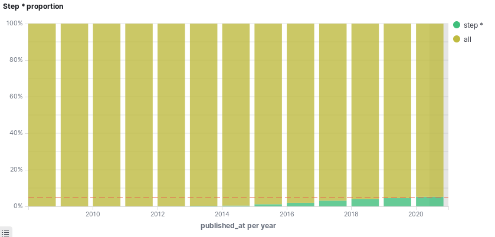

=========
ScrapHub
=========

.. image:: https://img.shields.io/badge/python-3.8+-blue
   :target: https://www.python.org/downloads/release/python-380/
   :alt: Python3.8+ compatible

.. image:: https://img.shields.io/badge/License-MIT-green.svg
   :target: https://github.com/thomasperrot/aes-square-attack/blob/master/LICENSE.rst
   :alt: MIT License

A scraping tools that gather data from Pornhub_ and provides a platform to analyze it.

.. _Pornhub: https://pornhub.com

Overview
========

ScrapPorn uses Scrapy_ to scrap data from Pornhub, and stores them into a local ElasticSearch_.
The harvested data can be analyzed using a local Kibana_ instance. ElasticSearch and Kibana instance
are run within Docker_ thanks to `Docker Compose`_

For example, did you know that about **5%** of 2020 porn movies deal with step son/daugther/mother/father ?
Amazing isn't it ?

.. _Scrapy: https://scrapy.org/
.. _ElasticSearch: https://www.elastic.co/fr/
.. _Kibana: https://www.elastic.co/fr/kibana
.. _Docker: https://www.docker.com/
.. _Docker Compose: https://docs.docker.com/compose/

Quickstart
==========

To install it, simply run:

.. code-block:: bash

   pip install .

Then start ElasticSearch and Kibana instance:

.. code-block:: bash

   docker-compose up -d

Finally, run the crawler using the following command:

.. code-block:: bash

   scrapy runspider scraphub/spiders/video_spider.py

Performances
============

To be a good citizen, I set the crawling speed to 1 request every 10 seconds. You can change that if you need in the
``settings.py`` file. I personally harvested a couple of millions of videos without much trouble.

Results
=======

Here are a couple of interested results I found:

About **5%** of porn movies in 2020 deal with step son/daugther/mother/father ! It was less than 0.1% a before 2015,
and is constantly increasing...

I hope you will find some things of interest yourself.

Issues
======

If you encounter an issue, please fill free to open an issue_.

.. _issue: https://github.com/thomasperrot/scraphub/issues
